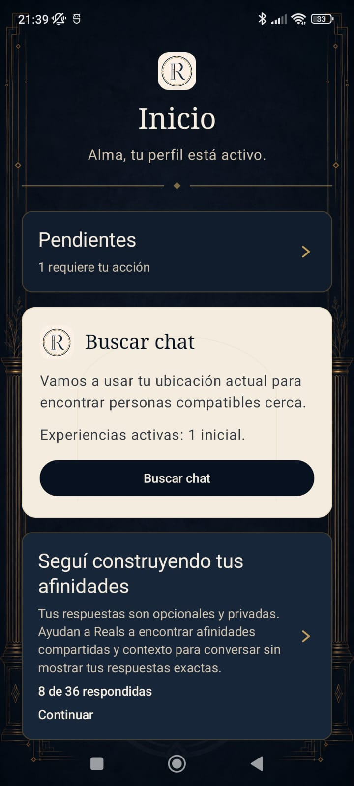
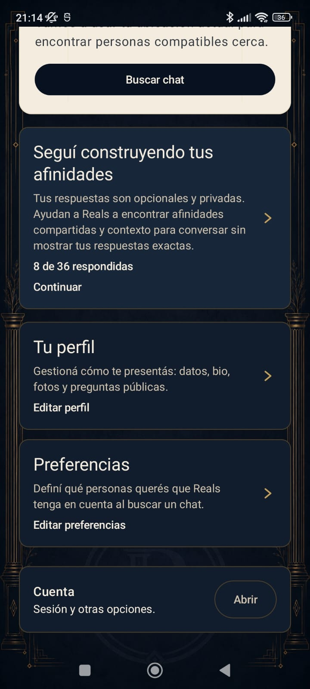
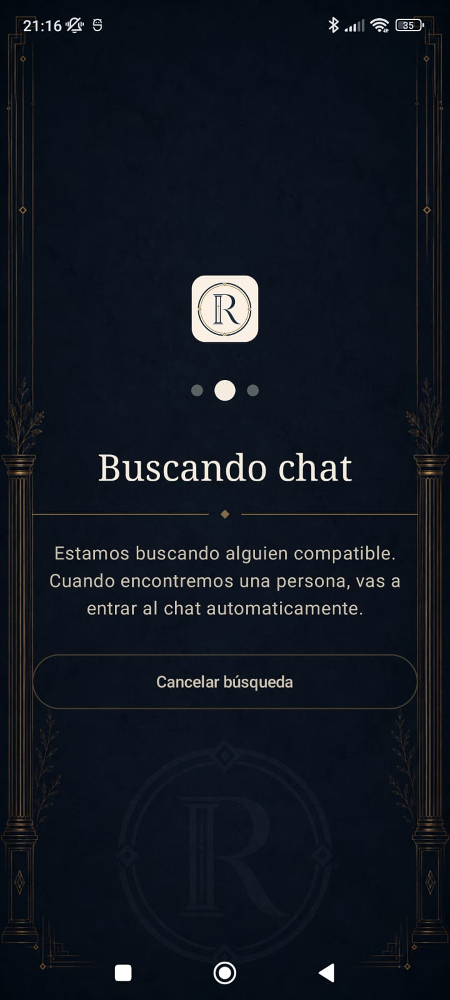
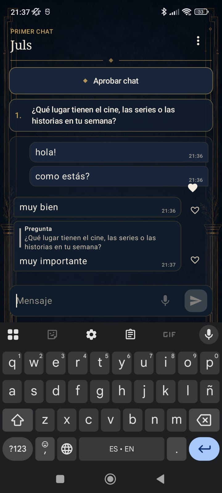
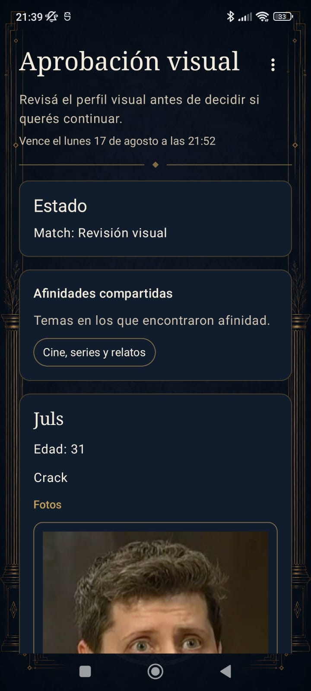
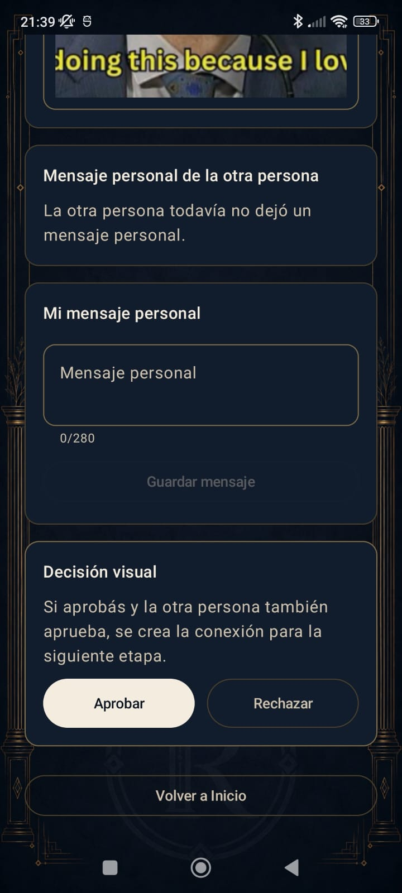
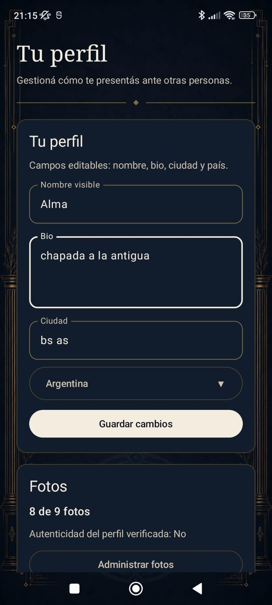
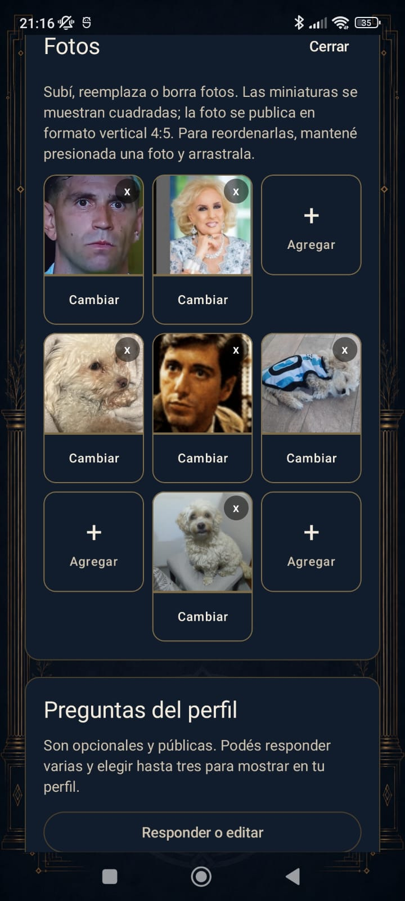
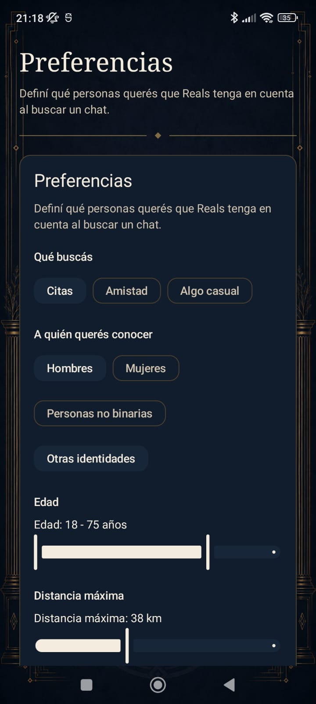

# Reals

**Conversation first. Profiles later.**

Reals is an Android dating app built around a staged interaction flow: people first connect through conversation, decide whether they want to continue, reveal their visual profiles only after mutual interest, and coordinate a second chat inside the app.

The Android client is written in **Kotlin + Jetpack Compose** and consumes the Reals backend as the source of truth for matchmaking, chat lifecycle, visual review, scheduling, safety, moderation, and interaction state.

## Product preview

<p align="center">
  
  
  
</p>

<p align="center">
  
  
  
</p>

<p align="center">
  
  
  
</p>

<p align="center">
  
  
</p>

## How Reals works

The product flow is intentionally different from swipe-first dating apps:

1. **Matchmaking** — eligible users enter the matchmaking flow and are paired by the backend.
2. **First chat** — the interaction starts with conversation rather than an immediately revealed visual profile. Backend-provided guidance questions can help move the conversation forward.
3. **Mutual decision** — both participants independently decide whether they want to continue.
4. **Visual review** — after mutual interest, the profile is revealed for an explicit visual decision.
5. **Scheduling** — mutual visual approval creates a connection and an in-app negotiation for the second-chat time.
6. **Second chat** — participants explicitly join the scheduled conversation, with server-authoritative attendance and lifecycle rules.

The backend owns the interaction state machine and deadlines. Android renders that state, collects user actions, and refreshes after meaningful transitions rather than locally inventing lifecycle state.

## Highlights

- **Conversation-first matching flow** with a staged profile reveal.
- **Guided first chat** backed by immutable conversation prompt snapshots.
- **Text and audio messaging**, shallow quoted replies, and lightweight message reactions.
- **Visual review** with photos, profile content, shared affinity indicators, and optional personal messages.
- **In-app second-chat scheduling** with proposal rounds, overlap detection, and conflict validation.
- **Server-authoritative countdowns and lifecycle transitions** for first chat, visual review, scheduling, and second chat.
- **Firebase Authentication**, **Firebase App Check**, and **Firebase Cloud Messaging**.
- **Safety and exit flows** integrated into both first and second chat.
- Separate **local**, **dev**, and **prod** Android flavors with isolated application IDs and environment-specific security behavior.

## Android stack

| Area | Technology |
| --- | --- |
| Language | Kotlin |
| UI | Jetpack Compose + Material 3 |
| Async | Kotlin Coroutines |
| Networking | Retrofit + OkHttp |
| Serialization | kotlinx.serialization |
| Images | Coil |
| Authentication | Firebase Authentication |
| App integrity | Firebase App Check |
| Push notifications | Firebase Cloud Messaging |
| Testing | JUnit, MockWebServer, Compose UI tests, Espresso |
| Build | Gradle / Android Gradle Plugin |

## Architecture

Reals keeps Compose screens mostly presentational and routes application behavior through a small set of coordinators and handlers.

```text
Compose Screen
    ↓
RealsRootViewModel
    ↓
Coordinator / Handler
    ↓
UseCase
    ↓
Repository
    ↓
RealsApi
```

The app deliberately does **not** use Navigation Compose. Root navigation is represented as application state and orchestrated by `RealsRootViewModel`, while feature-specific behavior lives in dedicated coordinators.

See [Android architecture](docs/architecture.md) for the current source layout, ownership rules, authentication/session behavior, App Check integration, and lifecycle UX conventions.

## Environments

Reals has one Android flavor dimension with three isolated environments:

| Flavor | Application ID | Purpose |
| --- | --- | --- |
| `local` | `com.reals.app.local` | Local backend development and repeatable test flows |
| `dev` | `com.reals.app.dev` | Hosted development environment |
| `prod` | `com.reals.app` | Production application |

Firebase configuration is flavor-specific and intentionally not committed to the repository.

For setup, environment rules, Firebase configuration, and build commands, see [Local development](docs/local-development.md).

## Documentation

The repository keeps implementation and operational documentation under [`docs/`](docs/README.md).

Useful entry points:

- [Architecture](docs/architecture.md)
- [Local development](docs/local-development.md)
- [Local Android networking](docs/local-android-networking.md)
- [Testing](docs/testing.md)
- [Security](docs/security.md)
- [Infrastructure](docs/infra.md)
- [Backend API summary](docs/commons/api.md)
- [OpenAPI contract](docs/commons/openapi.yaml)
- [Domain model](docs/commons/domain.md)
- [State machine](docs/commons/state-machine.md)
- [End-to-end user flow](docs/commons/user-flow.md)

`docs/commons/` mirrors the backend-owned shared contract and domain documentation so the Android implementation can stay aligned with the server source of truth.

## Backend

The corresponding backend lives in [Gtestino92/reals-backend](https://github.com/Gtestino92/reals-backend).

It owns matchmaking, domain lifecycle transitions, chat rules, scheduling, moderation, reliability/penalty behavior, persistence, and the REST API consumed by this Android client.
